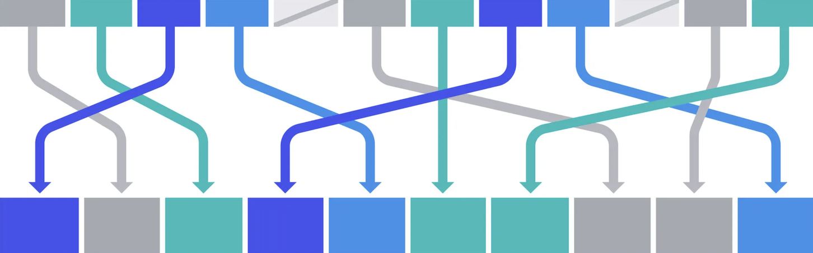

<figure markdown="span">
  
</figure>

## Icebreaker question  
[If you could magically change one annoying thing about coding forever, what would it be?](https://www.menti.com/alfkdjwcnv51)

<b>Icebreaker results</b>

<iframe sandbox='allow-scripts allow-same-origin allow-presentation' allowfullscreen='true' allowtransparency='true' frameborder='0' height='315' src='https://www.mentimeter.com/app/presentation/alhur8tnokazyfwxgx5i83rfekpoami6/embed' style='position: absolute; top: 0; left: 0; width: 100%; height: 100%;' width='420'></iframe>

## :material-book-variant: Learning objectives

In this session of class we will learn about hash tables, an efficient
data structure for mapping key/value pairs. By the end of this session 
you will be more familiar with the following topics:

- Hash tables: A practical & efficient data structure for storing *key*/*value* pairs
- Hash functions for mapping *keys* to integer values
- Useful hash function properties: Determinism, efficiency, & uniformity of hashes
- Collision-handling schemes: Separate chaining & Linear probing
- Load factor & hash table resizing

## :material-human-male-board-poll: In class exercises
- Why don't we just ask [ChatGPT](https://chatgpt.com/) to explain hash tables to us? It seems easier that way, and maybe then you won't need me anymore. :disappointed:
- [Lecture 1: Introduction to hash tables](../../lectures/1.0/)
- [Tutorial 1.0: Hash Table Excercises (jupyter notebook)](../../tutorials/1.0-hash-table-experiments)
- [Tutorial 1.1: Interactive Hash Table Exploration](../../tutorials/1.1-interactive-hash-tables)

## :material-list-box-outline: Assignments
- Implement hash table classes in python for each of the collision resolution
strategies we discussed today: and `HashTableChaining` for separate chaining; 
and `HashTableProbing` for linear probing. Add them to a `hash_tables.py`
file in the `data_structures` module of your CSCI232 github repo, and 
commit/push the changes when they are complete. 
- Read Chapter 12 "Sorting and Selection" in [Data Structures and Algorithms in Python by Goodrich, Tamassia & Goldwasser](https://www.wiley.com/en-us/Data+Structures+and+Algorithms+in+Python%2C+1st+Edition-p-9781118290279) [(pdf)](https://nibmehub.com/opac-service/pdf/read/Data%20Structures%20and%20Algorithms%20in%20Python.pdf)
- Watch the video [15 sorting Algorithms in 6 minutes](https://www.youtube.com/watch?v=kPRA0W1kECg)
    - Most visually satisfying: [Merge sort](https://youtu.be/kPRA0W1kECg?feature=shared&t=65)
    - Most intellectually satisfying: [Bogosort](https://youtu.be/kPRA0W1kECg?feature=shared&t=316)

-----------------------------------------------------

