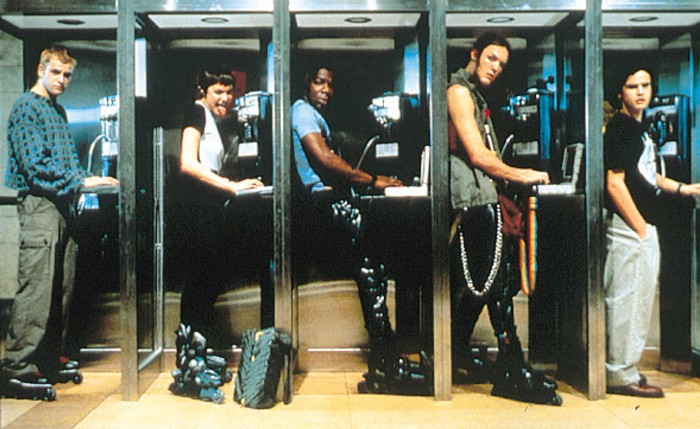

<figure markdown="span">
  
</figure>

## Icebreaker question  
If you could magically change one annoying thing about coding forever, what would it be?

## :material-book-variant: Learning objectives

In this session of class we will learn about hash tables, an efficient
data structure for mapping key/value pairs. By the end of this session 
you will be more familiar with the following topics:

- Hash tables
- A unix shell/terminal.
- Command line programs, including core system utilities.
- File system paths.
- Markdown.

## :material-human-male-board-poll: In class exercises
- [Interactive Hash Table Exercise](https://visualgo.net/en/hashtable) - Perhaps build this into a tutorial page
- Connect, login, and complete notebook 1 on the course server: [https://pinky.eaton-lab.org](https://pinky.eaton-lab.org)
- Link to [Lecture 1 slides](../../lectures/1.0/): Introduction to bash

## :material-list-box-outline: Assignments
- Implement a hash table class that uses linear probing for collision resolution
- Read Chapter 12 "Sorting and Selection" in [Data Structures and Algorithms in Python by Goodrich, Tamassia, & Goldwasser](https://www.wiley.com/en-us/Data+Structures+and+Algorithms+in+Python%2C+1st+Edition-p-9781118290279) [pdf](https://nibmehub.com/opac-service/pdf/read/Data%20Structures%20and%20Algorithms%20in%20Python.pdf)
- Watch the video: [15 sorting Algorithms in 6 minutes](https://www.youtube.com/watch?v=kPRA0W1kECg)

-----------------------------------------------------

<figure markdown="span">
  
</figure>

