# Interactive hash table exploration

## Learning objectives
By the end of this session you will develop experience with:  

- Understanding two basic hash table collision resolution strategies
    - Separate chaining  
    - Linear probing  
- Inserting, removing, and searching hash tables of these types  
- Understaning load factor and how it is calculated

## Launch the VisuAlgo hash table exploration tool

[Visu**algo**](https://visualgo.net/en) is a wonderful, interactive, online tool
for understanding the structure and functioning of numerous common data structures
and algorithms using intuitive visualizations.

Launch the [hash table explorer](https://visualgo.net/en/hashtable) in a new tab
(right click and 'Open Link in New Tab').

## Separate Chaining

Upon launching Visu**Algo** you'll be dropped into the **Separate Chaining**
'e-Lecture Mode'. You can exit this mode and enter 'Exploration Mode' by
simply clicking anywhere in the window outside the explanatory dialogue
pop-up. By default, it will populate the window with a new Hash Table
with random values for number of 'buckets' (`M`), and a random number of
items (`N`). Let's start by creating a new Hash Table with the same number of
buckets and items so we can all be looking at the same thing.

In the lower left there is a panel for applying different functions to
the simulation. Choose `Create(M, N)`. Set `M` = 10 and `N` = 20, and push
**Go**. The interface will populate a new 10 bucket hash table with
20 random integer values. Because we are so used to counting in base 10,
it's easy to see that the *compression function* being used is simply
`mod M` (the least significant digit of each *key* equals the index of
the bucket it is stored in).

After you create a new Separate Chaining hash table you should see something
like this, an array of buckets indexed 0-9, and a linked list of items within 
each bucket.
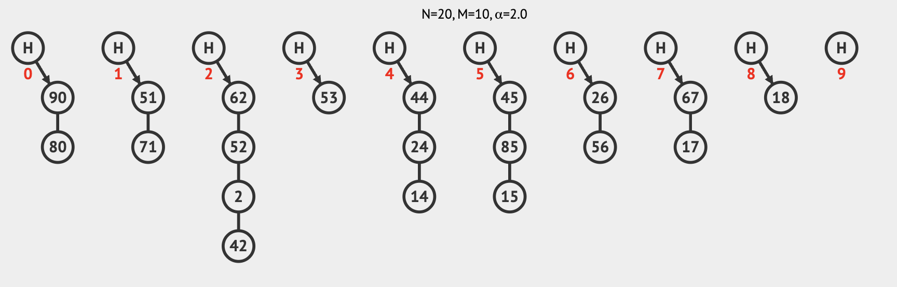

<b>Secondary containers of Separate Chaining Hash Tables</b>

In this instance, the VisuAlgo team has decided to implement the separate
chaining buckets as doubly-linked lists, which is smart because it means 
adding and removing items from the hash table will be really fast. This is 
a design decision which isn't always used, and which has complexity/performance
tradeoffs which we will discuss further.

### Separate Chaining Search

Pick the bucket in your simulation with the longest list of items and find
the last item in this list. Let's say we want to find this item in our hash 
table, how does the search algorithm work in this case.

In my example, the 'deepest' item is 42 (I did not do this on purpose, I swear
it was random), so in the leftnav I will choose `Search(v)`, enter 42 in the 
text field, and push **Go**. Here you will see an animation of the search 
process, where first the algorithm determines the correct bucket 
(`42 mod 10`). Finding this bucket full, it proceeds to walk down the list 
until it finds the item of interest.

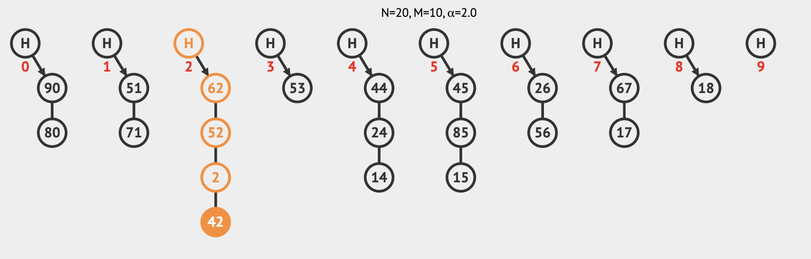

### Separate Chaining Insert
Insertion for Separate Chaining (in this implementation) does something
interesting. It first identifies the correct bucket with `mod`, and then it simply
appends the item to the doubly-linked list in this bucket (using the tail 
pointer of the first item). Choose a value that does not already appear in 
the bucket you have been manipulating (I will choose 12). On the leftnav select 
`Insert(v)` and enter 12 (or whatever you choose).

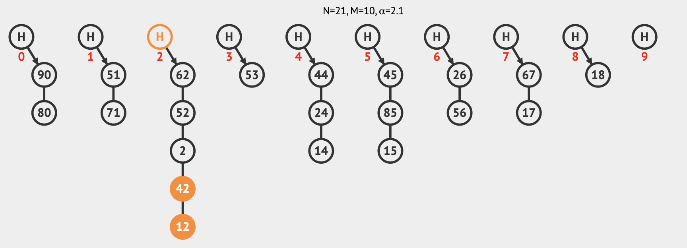

I said this behavior is interesting, so what might be interesting about it? What
are the consequences of this 'blind' tail insertion? What happens if you try
to insert this same item again? What are the benefits of this design choice and
why might this not be 'optimal' behavior?

### Separate Chaining Remove

Stick with bucket in your hash table with the most items (the one we have
been using so far) and pick and item in the bucket that you want to remove
(I'll remove 42). In  the lower-left open the function pane and choose 
`Remove(v)`, enter 42, and push **Go**. You'll see the animation of the
algorithm that defines item removal.

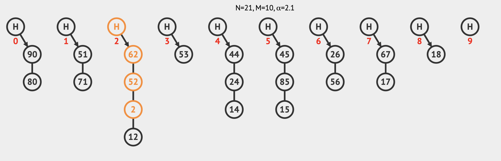

Try removing an item that doesn't exit (I will try to remove 42 again). In 
this case you can see the algorithm finds the appropriate bucket, and then 
walks the list searching for the item to remove. Not finding it, the program
informs you the item is not found in the hash table and quits. At this point,
in a python program it would throw a `KeyError` which you would have to handle
somehow.

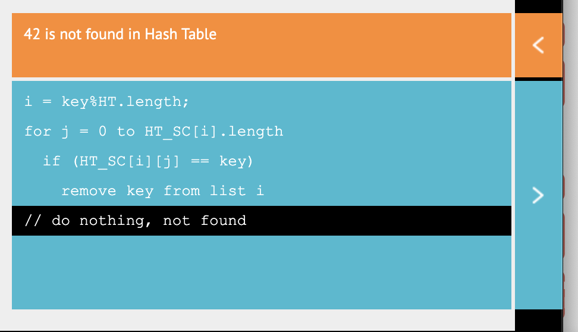

### Separate Chaining Load Factor
The Visu**Algo** interface also does a nice thing in automatically calculating
and presenting the **Load Factor** of this hash table. Recall from the reading
that load factor is defined as the the average number of items per bucket (more
specifically it is the ratio of the total number of items in the hash 
table divided by the length of the bucket array). In Visu**Algo** this is 
denoted as *α* with *α* = *N*/*M*.

<b>On differences in notation</b>

Notice that our reading uses slightly different notation (<em>λ</em> = 
<em>n</em>/<em>N</em>), where <em>λ</em> is load factor, <em>n</em> is number 
of items, and <em>N</em> is number of buckets. The notation is different but 
the equation is identical in meaning.

Create a new separate chaining hash table with `M` = 10 and `N` = 40. This is a
very 'full' hash table. As you will recall from the reading, core hash table
functions (insert/delete/search) degrade in performance as a function of *α*
(i.e. they run with *O*(*α*) on average).

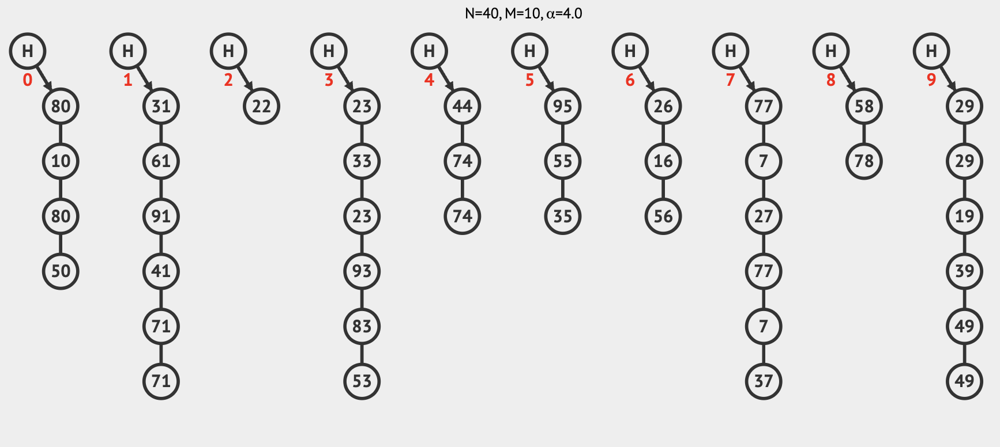

One of the useful features of separate chaining hash tables is that they are
still capable of operating (though with reduced performance) when *α* > 1. This
is not the case for all collision resolutions schemes, particularly Linear
Probing (though it has its own advantages).

## Linear Probing

Now we will turn to a different collision resolution scheme: **Linear Probing**.
In the top-nav click on **LP**, and this will switch you to the linear probing
exploration mode. Just like before, there are probably lots of buckets in the
default view, so choose `Create(M, N)` and set `M` = 10 and `N` = 5.

After you create a new Linear Probing hash table you should see something
like this, an array of buckets indexed 0-9, with 5 of the buckets occupied.
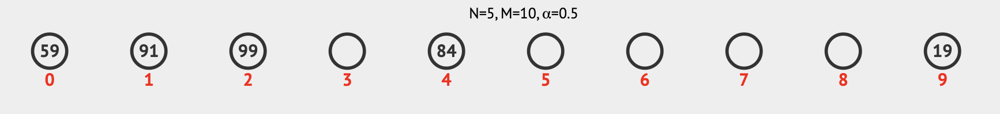

### Linear Probing Search
Here I will search for *key* 99.

#### Ooops!
Here is a good example of "your instructor isn't always right". The Visu**Alg**
hash table simulator correctly locates key 99 in the 2nd bucket, but the
interface tells us that this key wasn't found. Somebody should inform the
developers! :rofl:

### Linear Probing Insert
Pick an occupied bucket in your hash table with lots of consecutively 
occupied buckets downstream from it. Choose an integer value that will `mod`
to fill this chosen bucket. Now, look at the current state of the hash table
and try to predict which bucket this new item will go into. In this example I 
will choose an integer that mods to 0, so how about 0. Here is my result after
inserting 0:

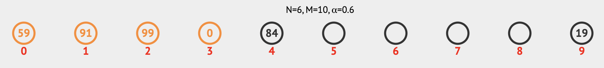

For yourself, choose `Insert(v)` and do something similar for your own hash 
table and you'll see the process the insertion algorithm takes to first check 
the *n*th bucket (which your chosen integer should `mod` to), and then 
to consecutively probe each subsequent bucket until it finds an empty one.

### Linear Probing Remove
Linear probing hash tables have to do a bit more work to maintain a consistent
state when items are removed. Unlike separate chaining, you can't just remove
an item and forget about it, because the position that the item is in might not be
the exact bucket that it belongs in, but rather it may have landed 'downstream'
from its true home because of intervening occupied buckets. This has consequences
for searching which we will return to momentarily. One mechanism for handling
this is to insert a special marker to denote 'available but formerly occupied'
buckets (from your reading on page 419).

I want to remove an item that has been inserted by probing (not in its 
'correct' bucket), so I'll choose 59 (which is currently in the 0th bucket). 
In the lower-left open the function pane and choose `Remove(v)`, enter 59 and
click **GO**. You'll see the algorithm check the 9th bucket, wrap around to the
0th before it finds the correct item to remove.

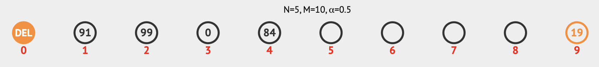

Visu**Alg** denotes deleted but available buckets with the **DEL** marker. 
Let's see how it handles searching and inserting with this pseudo-vacant bucket.

For me, I will now try searching for 99 (in the 2nd bucket). I want the search
algorithm to 'skip over' the **DEL** bucket in the search. It's empty, but
not occupied.

Now what happens if I try to insert 29? Think to yourself where this item
will land in the hash table.

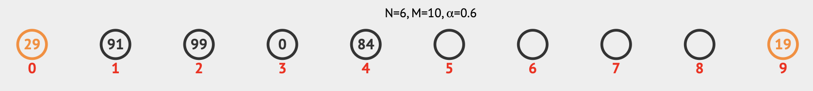

To maintain consistency **DEL** is skipped over for searches, but not for
insert operations! 29 lands in the first available bucket downstream from
bucket 9, which is the vacant 0 bucket in this case. It's all quite clever!

One last experiment is to try removing an item that doesn't exit. For me lets 
try to remove 42, the 2nd bucket (where 42 'belongs') is full and there 
several full buckets downstream so it should be interesting. (**NB:** Like 
`search`, `remove` should also skip **DEL** buckets, but we don't validate 
this behavior here).

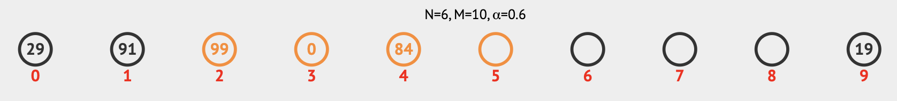

### Linear Probing Load Factor
The Visu**Algo** interface is still showing us the load factor (α), which
I am sure you can guess for the hash table we have created is 0.5.

## Hack the planet
Here comes my favorite part of being a computer scientist: To learn a new
tool and then to figure out how I can break it! This is actually not wanton
destructivism, we can actually learn a **lot** about how a tool works by 
studying edge cases and boundary conditions. Edge cases and boundary 
conditions can be pretty much anything you think the programmers who designed
this interface did not anticipate as acceptable input. Think about the 'expected'
input values and try to nudge these in different directions. If a function
wants a number, give it a string, give it a negative number, give it a really 
big number, how about a float? Push the boundaries and you'll see better how the
tool behaves. In specific, here what you will mostly be learning about is the
behavior of the Hash Table data structure as implemented by Visu**Algo**, but
this mindest of what is sometimes called 
['fuzzing'](https://en.wikipedia.org/wiki/Fuzzing) is applicable everywhere, 
and it's fun!

Spend a few minutes testing edge cases and see if you can find any interesting
behavior to report back to the class.
