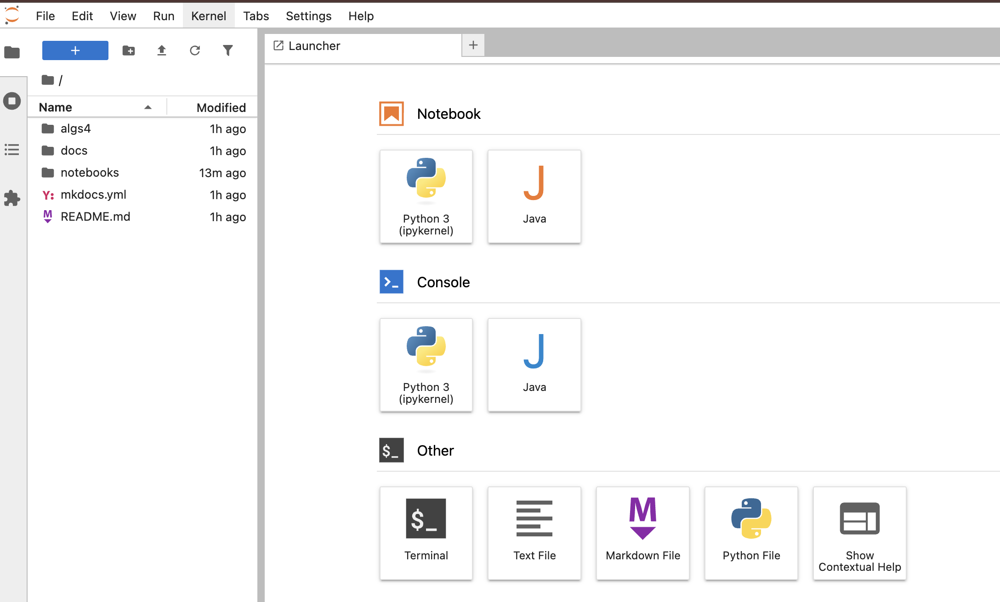

# Hash Table Exercises (jupyter notebook)

## Learning objectives
By the end of this session you should:  
- Have a good working understanding hashing  
- Be able to articulate the need for determinism, efficiency, & uniformity
in a good hash function

## Launch the CSCI 232 repo in binder
This activity is stored in our [class github repository](https://github.com/isaacovercast/CSCI232) 
as a jupyter notebook. The easiest way to interactively manipulate
this notebook is by launching our github repo in using [Binder](https://binderhub.readthedocs.io/en/latest/), a cloud based service for sharing
reproducible interactive computing environments from github repos.

In practice, Binder is great for one-off sessions like workshops (or teaching
demonstrations). In a real classroom environment the students would
almost certainly have cloned the class repo and be launching and running
these notebooks on their local machines. For this exercise you can launch
the github repo in Binder by opening this link in a new tab:

After your Binder instance spins up (it could take a few seconds or a few
minutes depending on if it has been launched and cached recently), it will drop
you into the Jupyter Lab interface, with a file browser on the left, and the
Launcher in the main panel.

In the left nav go to **Notebooks**, and open (by double-clicking)
**`nb-1.1-hash-table-experiments.ipynb`**, this will launch the notebook for 
this exercise in the main panel, and you may proceed to follow the rest 
of the tutorial that it contains.

